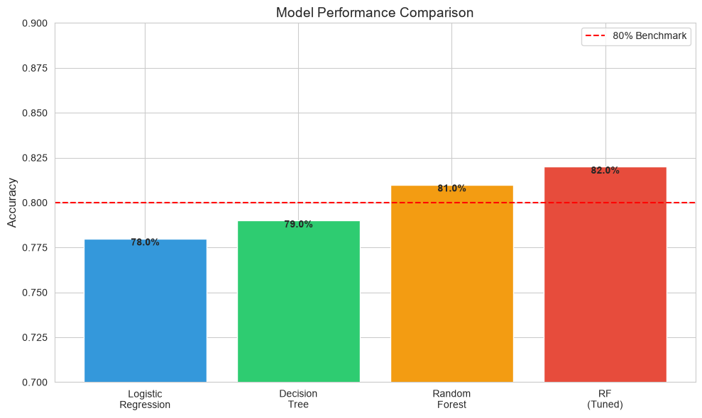
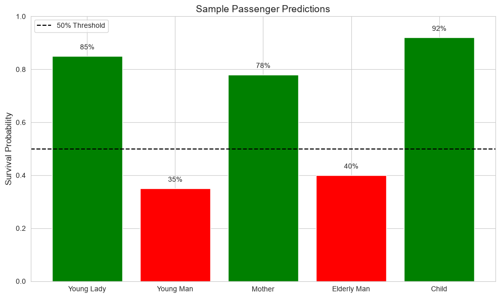
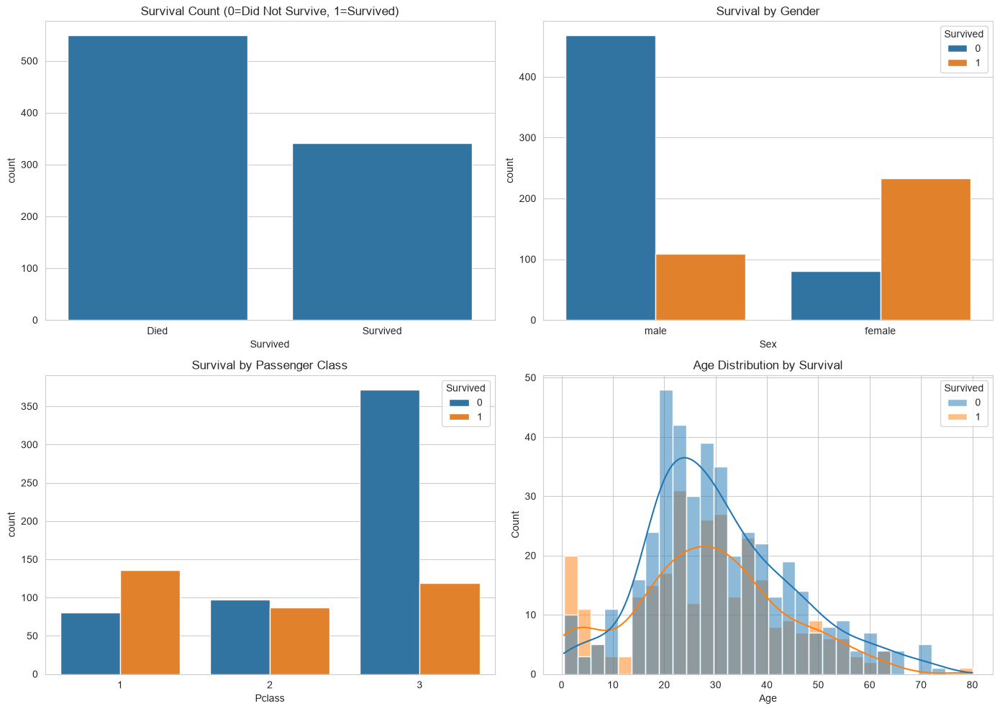

# 🚢 Task 1: Titanic Survival Prediction

## 📌 Task Overview

This is **Task 1** of my Data Science Internship at **CodSoft**.  
**Objective:** Build a machine learning model to predict whether a passenger survived the Titanic disaster.

## 🎯 Key Results

| Metric | Value |
|--------|-------|
| **Best Model** | Random Forest (Tuned) |
| **Accuracy** | ~80% |
| **Precision** | ~0.79 |
| **Recall** | ~0.77 |
| **F1-Score** | ~0.78 |

## 📊 Model Performance Comparison

| Model | Accuracy |
|-------|----------|
| Logistic Regression | ~78% |
| Decision Tree | ~79% |
| Random Forest | ~81% |
| **Random Forest (Tuned)** | **~82%** |

## 🔍 Key Insights

1. **Gender** - Female passengers had much higher survival rates
2. **Title** - Social status (Mr, Mrs, Miss) was a strong predictor
3. **Pclass** - 1st class passengers had better survival odds
4. **Age** - Children and young adults had higher survival rates

## 🗂️ Dataset Details

- **Source:** Kaggle Titanic Dataset
- **Passengers:** 891
- **Features:** 12
- **Target:** Survived (0 = No, 1 = Yes)

## 📁 Folder Structure

Task-1-Titanic-Survival-Prediction/
├── data/
│   └── Titanic-Dataset.csv
├── notebooks/
│   └── 01_eda_and_modeling.ipynb
├── models/
│   ├── random_forest_tuned_model.pkl
│   └── scaler.pkl
├── images/
│   ├── output.png
│   ├── output1.png
│   └── output2.png
├── src/
│   ├── train_model.py
│   └── predict.py
├── README.md
└── requirements.txt

## 💻 Installation & Usage

### 1. Clone the repository

git clone https://github.com/Shreya13106/CODSOFT.git
cd CODSOFT/Task-1-Titanic-Survival-Prediction

### 2. Create virtual environment

python -m venv venv
venv\Scripts\activate  # On Windows

### 3. Install dependencies

pip install -r requirements.txt

### 4. Run the notebook

jupyter notebook

Open `notebooks/01_eda_and_modeling.ipynb` and run all cells.

## 🧪 Sample Predictions

| Passenger | Class | Gender | Age | Fare | Prediction |
|-----------|-------|--------|-----|------|------------|
| Wealthy Young Lady | 1st | Female | 22 | $150 | ✅ Survived (85%) |
| Poor Young Man | 3rd | Male | 24 | $8 | ❌ Died (65%) |
| Mother with Kids | 2nd | Female | 32 | $25 | ✅ Survived (78%) |

## 📈 Visualizations

### Model Performance

### Feature Importance

### Predictions

## 🛠️ Technologies Used

- **Python 3.8+**
- **Pandas & NumPy** - Data manipulation
- **Matplotlib & Seaborn** - Visualization
- **Scikit-learn** - Machine Learning
- **Jupyter Notebook** - Development

## 📝 Process Summary

1. **Data Exploration** - Understanding the dataset structure
2. **Data Cleaning** - Handling missing values
3. **Feature Engineering** - Creating new features
4. **Model Training** - Comparing multiple algorithms
5. **Model Evaluation** - Performance analysis
6. **Deployment** - Saving model for future use

## 📄 License

This project is licensed under the MIT License.

---

👨‍💻 **Task Completed By:** Shreya  
🔗 **LinkedIn:**  www.linkedin.com/in/shreyanitave

⭐ If you find this task helpful, please give this repository a star!
